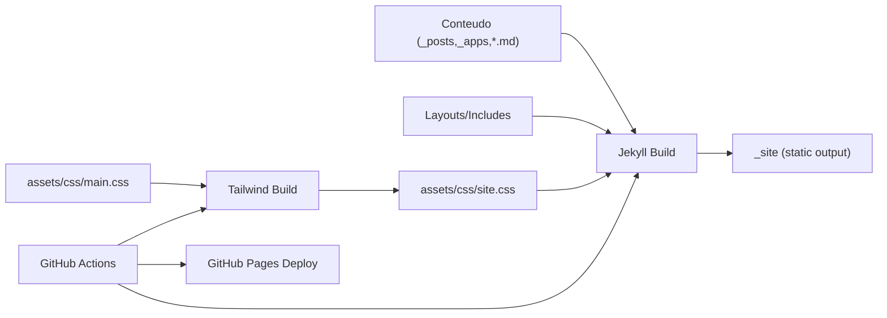

# Template de Especificação Técnica

## Resumo Executivo

Vamos manter o site em **Jekyll/Liquid** e modernizar a camada visual com **Tailwind CSS**, removendo o tema “light” e deixando o site **dark-only**. O deploy será automatizado via **GitHub Actions**, que compila o Tailwind e executa o build do Jekyll para publicação no GitHub Pages.

O site será estruturado em quatro áreas principais (Home, Apps, Blog, Sobre). A seção de Apps será implementada como uma **coleção Jekyll** (`_apps/`) com páginas de detalhe geradas automaticamente.

## Arquitetura do Sistema

### Visão Geral dos Componentes

- **Jekyll (build estático)**: gera HTML final a partir de layouts (`_layouts/`), includes (`_includes/`), posts (`_posts/`) e coleção de apps (`_apps/`).
- **Tailwind CSS (build)**: compila `assets/css/main.css` em `assets/css/site.css` (minificado).
- **GitHub Actions**: pipeline de build e deploy do site.
- **Busca (opcional)**: `search.json` gerado pelo Jekyll + `SimpleJekyllSearch` no frontend.

Fluxo de dados (alto nível):

## Design de Implementação

### Interfaces Principais

Não há serviços/SDKs internos (site estático). A “interface” principal é a modelagem de conteúdo em front matter de Markdown.

### Modelos de Dados

#### App (coleção `_apps/`)

Campos mínimos (front matter):

- `title` (string)
- `tagline` (string, opcional)
- `description` (string, opcional)
- `status` (string, opcional)
- `featured` (bool, opcional)
- `stack` (lista de strings, opcional)
- `links` (objeto, opcional): `website`, `app_store`, `github`
- `cover_image` (string, opcional)
- `screenshots` (lista de strings, opcional)
- `highlights` (lista de strings, opcional)

### Endpoints de API

Não aplicável (site estático).

## Pontos de Integração

- **GitHub Pages**: deploy via Actions.
- **Google Fonts**: fontes carregadas via `fonts.googleapis.com`.
- **SimpleJekyllSearch**: busca client-side usando `search.json`.

## Abordagem de Testes

### Testes Unitários

Sem testes unitários (site estático). Validação prática:

- Build do Jekyll (sem erros) em CI.
- Verificação visual/responsiva local.
- Checagem de links e navegação.

## Sequenciamento de Desenvolvimento

### Ordem de Construção

1. **Modelagem de Apps** (coleção + layouts) para garantir que a seção de produtos tenha base sólida.
2. **Tailwind + Actions** para garantir pipeline e deploy confiáveis.
3. **Layout base (nav/footer) e dark-only** para unificar a UI.
4. **Home** como landing profissional.
5. **Apps** (polir cards/detalhes/screenshot).
6. **Blog** (listagem + post + busca opcional).
7. **Sobre** (narrativa e links).
8. **Polimento** (SEO/a11y/perf/404).

### Dependências Técnicas

- Node (para Tailwind) disponível no GitHub Actions.
- Ruby/Bundler (para Jekyll) disponível no GitHub Actions.

## Considerações Técnicas

### Decisões Principais

- **Sem React**: manter manutenção simples com Liquid/Jekyll.
- **Coleção `_apps/`**: facilita páginas de detalhe e conteúdo versionado.
- **Dark-only**: reduz complexidade (sem toggle, sem duplicidade de tokens).
- **Tailwind**: acelera construção do visual e mantém consistência.
- **Actions**: build confiável, sem necessidade de commitar CSS gerado.

### Riscos Conhecidos

- **Purge do Tailwind**: classes em templates JS (ex: template de busca) precisam estar incluídas em `content` do Tailwind config.
- **Plugins Liquid**: filtros customizados (ex: `remove_chars`) precisam estar presentes para o build (resolvido com `_plugins/remove_chars.rb`).

### Requisitos Especiais

- Acessibilidade básica (menu mobile com `aria-*`, foco visível).
- Performance: CSS minificado; páginas sem JS pesado.

### Conformidade com Padrões

- (N/A) Regras específicas de `.cursor/rules` não foram fornecidas nesta workspace.

### Arquivos relevantes

- Layout/estrutura:
  - `_layouts/default.html`
  - `_layouts/home.html`
  - `_layouts/blog.html`
  - `_layouts/post.html`
  - `_layouts/apps.html`
  - `_layouts/app.html`
  - `_includes/head.html`
  - `_includes/nav.html`
  - `_includes/footer.html`
- Conteúdo:
  - `_posts/`
  - `_apps/`
  - `apps/index.md`
  - `blog/index.md`
  - `sobre/index.md`
- Tailwind:
  - `assets/css/main.css`
  - `tailwind.config.js`
  - `postcss.config.js`
  - `package.json`
- CI/CD:
  - `.github/workflows/pages.yml`
- Busca:
  - `search.json`
  - `assets/js/search.js`
  - `assets/js/simple-jekyll-search.min.js`

